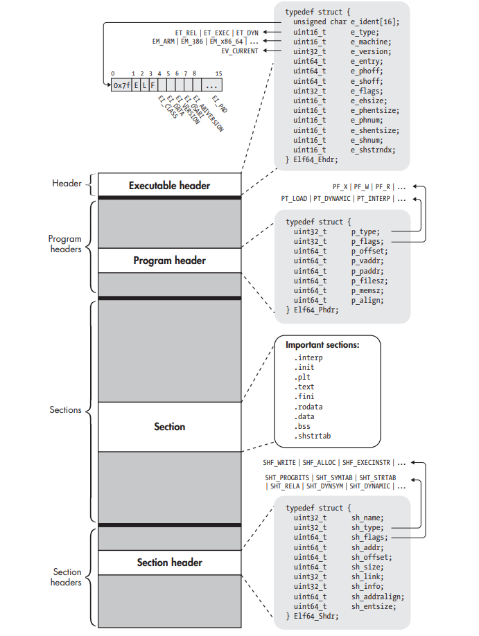
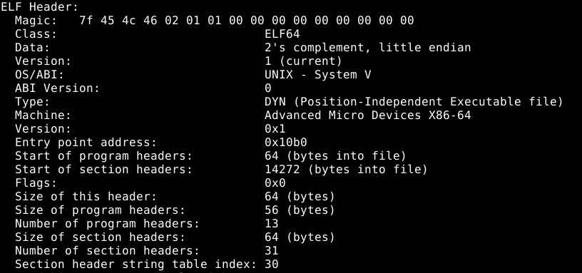
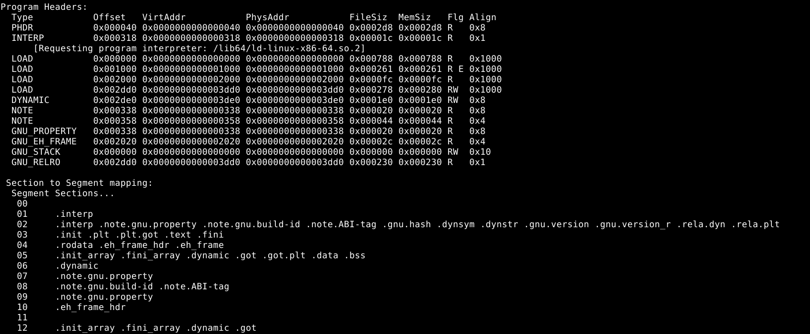
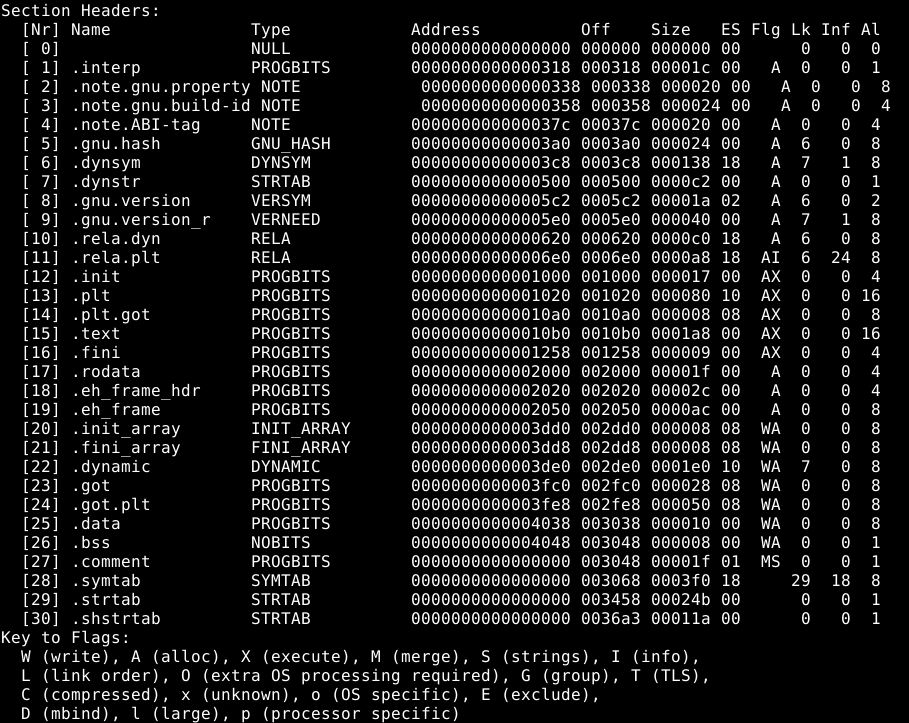
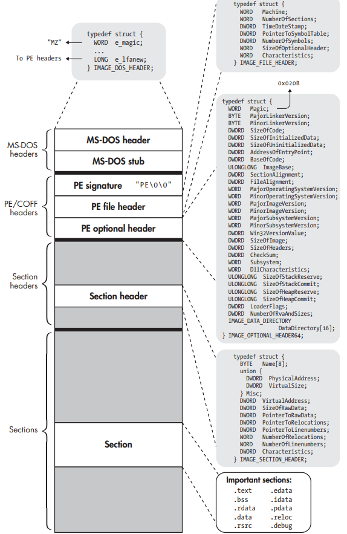
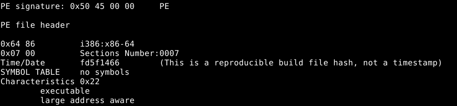
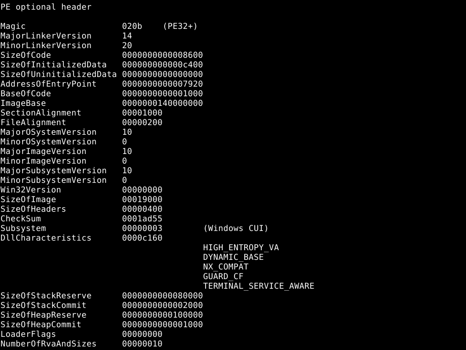
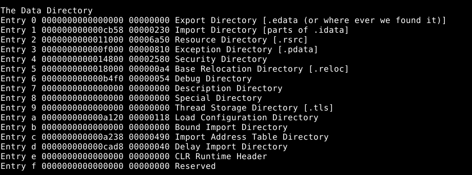
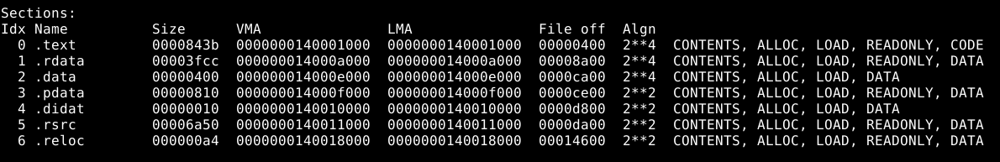
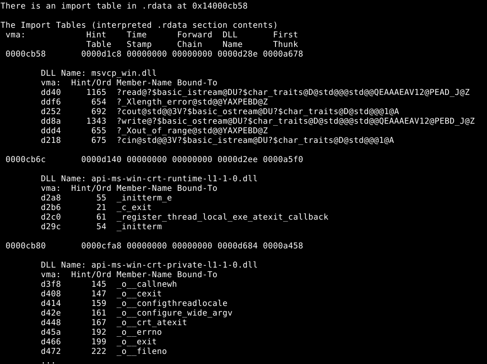

Notes from books[^1] [^2] and my understanding.

## Symbol Related Information:

### 1. DWARF

Debug symbols provide a complete mapping between source code lines and binary-level instructions, and even describe function parameters, stack frame information, etc. For ELF binaries, debug symbols are typically generated in the DWARF format, whereas PE binaries commonly use the proprietary Microsoft Portable Debugging (PDB) format. DWARF information is usually embedded within the binary file, while PDB appears as a separate symbol file.

### 2. Stripped

The `strip` tool applies to various formats like ELF and PE. Symbol information is very useful for binary analysis. For example, each function symbol can serve as a starting point for disassembly, reducing the chance of accidentally disassembling data as code. Knowing which parts of the binary belong to which function and what that function is called also makes it easier for reverse engineers to understand what the code is doing. However, in real-world scenarios such as malware and protected software, debug symbols and even basic symbol information are often stripped to reduce file size and hinder reverse engineering. After stripping a file using the command `strip --strip-all`, one can observe: except for `.dynsym` and `.dynstr` (due to dynamic linking requirements) and `.shstrtab` (which stores basic section names), `.symtab` and `.strtab` are completely removed. Consequently, individual variables and functions lose their corresponding symbols and are represented in forms like `fcn.[addr_offset]`.
   Notably, dynamic library global functions are stored in the `.dynsym` section, so they remain linkable even after stripping.

### 3. For executable files, the section header table can also be stripped.

## ELF

ELF (Executable and Linkable Format) is the format used for executable files, object files, shared libraries, and core dumps on Linux operating systems. The ELF format consists of four parts: the ELF Header, the Program Header Table, various Sections, and the Section Header Table.

The diagram below shows the position of each part within the format, the corresponding data structures, and important fields within those data structures. These data structures are defined in `/usr/include/elf.h`.



### 1. ELF Header
```c
/* Elf64_Ehdr */
typedef struct {
    unsigned char e_ident[16]; /* Magic number and OS information */
    uint16_t      e_type;      /* File type */
    uint16_t      e_machine;   /* Architecture */
    uint32_t      e_version;   /* File version */
    uint64_t      e_entry;     /* Virtual address of program entry point */
    uint64_t      e_phoff;     /* Offset of program header table */
    uint64_t      e_shoff;     /* Offset of section header table */
    uint32_t      e_flags;     /* Processor-specific flags */
    uint16_t      e_ehsize;    /* Size of ELF header */
    uint16_t      e_phentsize; /* Size of one program header table entry */
    uint16_t      e_phnum;     /* Number of program header table entries */
    uint16_t      e_shentsize; /* Size of one section header table entry */
    uint16_t      e_shnum;     /* Number of section header table entries */
    uint16_t      e_shstrndx;  /* Section header table index for section name string table */
} Elf64_Ehdr;
```

The ELF header of an executable file can be viewed using `readelf -h test`:



The file type in the ELF header is specified in the `e_type` field:
*   `ET_NONE`: Unknown/undefined type.
*   `ET_REL`: Relocatable file (`.o` format file).
*   `ET_EXEC`: Executable file.
*   `ET_DYN`: Shared object file, loaded and linked into the process image at runtime.
*   `ET_CORE`: Core file, which records the entire process image when a program crashes or receives a SIGSEGV (segmentation violation) signal.

### 2. A Program Header Table Entry

Provides the segment view. When loading an ELF file into a process for execution, the segment view is used to locate relevant code and data, thereby loading various sections into different virtual memory addresses.
```c
/* Elf64_Phdr */
typedef struct {
    uint32_t   p_type;    /* Segment type */
    uint32_t   p_flags;   /* Segment access permissions at runtime */
    uint64_t   p_offset;  /* File offset of the section(s) corresponding to this segment */
    uint64_t   p_vaddr;   /* Virtual address of the segment */
    uint64_t   p_paddr;   /* Physical address of the segment */
    uint64_t   p_filesz;  /* Size of the segment in the file */
    uint64_t   p_memsz;   /* Size of the segment in virtual memory */
    uint64_t   p_align;   /* Segment alignment */
} Elf64_Phdr;
```

The program headers of an ELF executable can be viewed using `readelf --wide --segments test`:



It can be seen that the mapping of sections to segments is essentially the merging of one or more sections together. Segments marked `LOAD` are aligned to `0x1000`, i.e., a 4096-byte memory page.

Segment types in the program header, specified in the `p_type` field:
*   `PT_LOAD`: Describes loadable segments, such as `.text` and `.data`.
*   `PT_DYNAMIC`: The program header for the dynamic segment, containing tags and pointers.
*   `PT_NOTE`: Stores specification information for the OS, vulnerable to virus infection.
*   `PT_INTERP`: Stores only location and size information in a null-terminated string.
*   `PT_PHDR`: Stores the location and size of the program header table itself.

### 3. A Section Header Table Entry

Compared to the segment view, the section view is used only for static linking. For example, object files modify code based on the section view during static linking. ELF files that do not require linking may not have a section header table. Therefore, after linking object files to create an executable, the section header table is optional, and the program header table is sufficient for mapping sections to segments.
```c
/* Elf64_Shdr */
typedef struct {
    uint32_t   sh_name;       /* Section name (index into string table) */
    uint32_t   sh_type;       /* Section type */
    uint64_t   sh_flags;      /* Section permission flags */
    uint64_t   sh_addr;       /* Virtual address where section is loaded (if applicable) */
    uint64_t   sh_offset;     /* File offset of the section */
    uint64_t   sh_size;       /* Size of the section in bytes */
    uint32_t   sh_link;       /* Link to another section (index) */
    uint32_t   sh_info;       /* Additional information */
    uint64_t   sh_addralign;  /* Section alignment */
    uint64_t   sh_entsize;    /* Entry size (for sections like relocation that contain a table) */
} Elf64_Shdr;
```

If an executable file still has a section header table, detailed section information can be viewed using `readelf --wide --sections test`:



### 4. Sections

ELF files divide code and data into sections. Sections do not have a corresponding structure; they are simply blocks of binary information. Taking an ELF executable as an example, all its sections can be viewed using `readelf --sections --wide test`, and specific sections can be examined using `objdump -d --section … test`. Notably, not every section with the `A` (allocatable) flag is mapped into a segment at runtime. For instance, with `full relro` enabled, `.plt.got` may be mapped into a segment instead of the lengthy `.plt` and `.got`.
```c
/* Some Interesting Sections */
.init / .ctors      /* Contains executable code performing initialization work. */
.fini / .dtors      /* Contains executable code, acting as a destructor counterpart to .init. */
.text               /* Executable, non-writable main code section, containing main, _start, register_tm_clones, etc. */
.rodata             /* Read-only, non-writable section storing constant values. */
.data               /* Writable, non-executable section storing default values for initialized variables. */
.bss                /* Writable section that occupies no file space; it's an instruction to zero-initialize a block of memory. */
.plt .got .got.plt .plt.got  /* Dynamic linking related; see Comprehensive Example - Relocation and Position Independence. */
.rela.dyn .rela.plt /* Dynamic linking related; tables of relocation entries. */
.dynamic            /* Dynamic linking related; dynamic information table. */
.dynsym .dynstr     /* Dynamic linking related; symbols and strings. */
.shstrtab           /* String table containing names of all sections, indexed by the section header table. */
.symtab .strtab     /* Symbols and strings, typically stripped. */
.init_array         /* Array of pointers to functions serving as constructors, e.g., frame_dummy. */
.fini_array         /* Similarly, array of pointers to functions serving as destructors, e.g., __do_global_dtors_aux. */
```

## PE

PE (Portable Executable) is the format used for executable files, object files, shared library files, and core dumps on the Windows operating system. PE (and most other binary formats) share many similarities with ELF. The PE format also consists of four parts: the MS-DOS Header, the PE/COFF Header, various Sections, and the Section Header Table.

The diagram below shows the position of each part within the format, the corresponding data structures, and important fields within those data structures. These data structures are defined in `WinNT.h`.



### 1. MS-DOS Header

Analysis with `ghex` reveals two important fields: `e_magic` (two bytes `4D 5A`, i.e., "MZ") and `e_lfanew` at offset `0x3C`, which is a file offset pointing to the PE header. Using `e_lfanew` allows bypassing the stub to reach the PE header.

### 2. PE Header

Analysis with `ghex` and `objdump` shows the four-byte signature `50 45 00 00` ("PE\0\0") at the beginning, followed by the PE File Header and the PE Optional Header.
The File Header describes general attributes of the file. The most important fields are `Machine`, `NumberOfSections`, `SizeOfOptionalHeader`, and `Characteristics`. The two fields describing the symbol table are deprecated; PE files no longer use embedded symbols and debugging information. The `Characteristics` field contains flags describing aspects of the binary such as endianness, whether it is a DLL, and whether it is stripped.



The PE Optional Header is, in fact, not optional for executable files. The base virtual address of `.text` can be found by calculating `ImageBase + BaseOfCode`. The `AddressOfEntryPoint` field contains the entry point address of the binary.



The `DataDirectory` is essentially a shortcut for the loader, allowing it to quickly locate specific data without traversing the section header table. The three most important entries are Entry0 and Entry1 (serving as tables for export and import functions, respectively), and the entry at Entry5 (serving as the relocation table).



### 3. PE Section Header Table
Each entry describes a section, including its size, virtual address, file offset, alignment, and permissions.



Unlike ELF, the PE format does not clearly distinguish between segments and sections. The closest equivalent in PE to ELF's execution view is the `DataDirectory`, which provides shortcuts for the loader to set up necessary parts of the binary for execution. PE does not have a separate program header table; the PE Section Header Table serves both linking and loading purposes.

### 4. Sections

The most significant difference from ELF is that PE has a `.rdata` section, which actually contains the `.edata` and `.idata` sections, holding the export and import function tables, respectively. Specifically, the `.idata` section specifies which symbols (functions and data) the binary imports from shared libraries or DLLs. The `.edata` section may not exist.



When the loader resolves dependencies, it writes to the Import Address Table (IAT) in Entry. Similar to the GOT in ELF, the IAT is simply a table of resolved pointers, with one slot per pointer. The IAT is also part of the `.idata` section, which initially contains pointers to the symbols to be imported. The dynamic loader then replaces these pointers with pointers to the actual imported functions or variables. Subsequently, calls to library functions are relocated to call the slot for that function in the IAT.

[^1]: Practical Binary Analysis
[^2]: Learning Linux Binary Analysis 