## Binary Loading

When a binary file is loaded, the shell or GUI calls `execve()`, which executes the Linux system call `int execve(const char *filename, char *const argv[], char *const envp[])`. This call preserves file descriptors 0, 1, and 2 (stdin, stdout, stderr) set by the shell.

### 1. map sections

First, `load_elf_binary` is called. It uses the program headers to map sections of type `PT_LOAD` into memory segments. If dynamic linking is required, it finds the `.interp` section within the segments, opens its program header, and calls `load_elf_interp` to map the segments of the linker (`ld`) from physical memory into the virtual address space. The `rip` (instruction pointer) in the process context is then set to the linker's entry point (`entry`).

### 2. stack initialization

Next, `create_elf_tables` is called to push information like `argc`, `argv`, `envp`, and the auxiliary vector (`auxv`) onto the user-space stack. After initialization, the user-space stack layout is as follows:

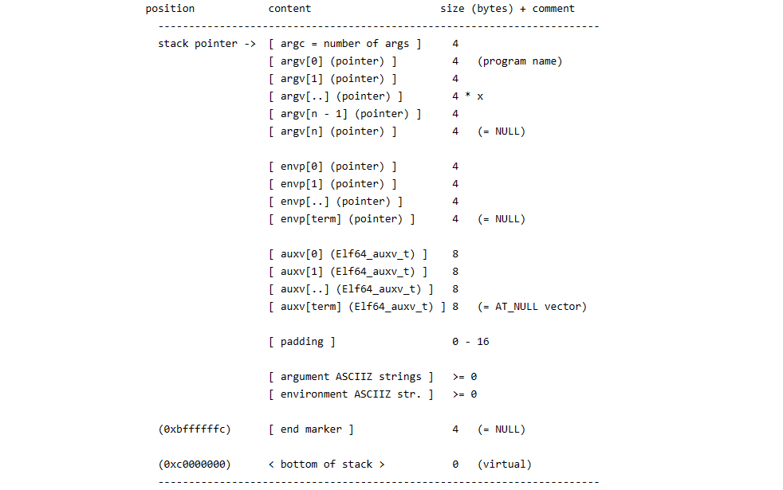

*   `argc`: A 4-byte value representing the number of arguments.
*   `argv`: An array of pointers pointing to the argument strings (ASCII). By default, the first `argv` points to the program name.
*   `envp`: The user environment variables, stored as an array of pointers pointing to environment variable strings (ASCII). Common examples include:
    *   `SHELL`: The current shell (e.g., `/bin/bash`).
    *   `USER`: The current username.
    *   `PWD`: The current working directory.
    *   `HOME`: The current user's home directory.
    *   `LOGNAME`: The login name of the user.

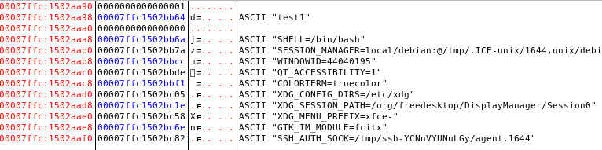

*   `auxv`: Auxiliary Vector is placed at the bottom of the stack (towards higher addresses) to pass information to the dynamic linker. It consists of a series of `ElfN_auxv_t` structures:
```c
typedef struct {
    uint64_t a_type;    /* Entry type */
    union {
        uint64_t a_val; /* Auxiliary vector value */
    } a_un;
} Elf64_auxv_t;

/* a_type values */
#define AT_NULL         0  /* End of vector */
#define AT_IGNORE       1  /* Entry should be ignored */
#define AT_EXECFD       2  /* File descriptor of program (if changed after fork) */
#define AT_PHDR         3  /* Program headers for the program */
#define AT_PHENT        4  /* Size of program header entry */
#define AT_PHNUM        5  /* Number of program headers */
#define AT_PAGESZ       6  /* System page size */
#define AT_BASE         7  /* Base address of the linker (ld) */
#define AT_FLAGS        8  /* Flags */
#define AT_ENTRY        9  /* Program entry point */
#define AT_NOTELF       10 /* Program is not ELF */
#define AT_UID          11 /* Real user ID */
#define AT_EUID         12 /* Effective user ID */
#define AT_GID          13 /* Real group ID */
#define AT_EGID         14 /* Effective group ID */
#define AT_PLATFORM     15 /* String identifying CPU for optimizations */
#define AT_HWCAP        16 /* Architecture-dependent CPU capability hints */
#define AT_CLKTCK       17 /* Frequency of times() increments */
/* AT_* values 18 through 22 are reserved */
#define AT_SECURE       23 /* Secure mode boolean */
#define AT_BASE_PLATFORM 24 /* String identifying true platform, may differ from AT_PLATFORM */
#define AT_RANDOM       25 /* Address of 16 random bytes */
#define AT_HWCAP2       26 /* Extension of AT_HWCAP */
#define AT_EXECFN       31 /* Filename of the program */
```
The ELF auxiliary vector is a mechanism for transmitting certain kernel-level information to the user process. An example of such information is the pointer to the system call entry point in memory (`AT_SYSINFO` 32). Other useful information includes the program entry point, program headers, page size, etc. Set `LD_SHOW_AUXV=1` to view an example. With ASLR enabled, since the page size is 4KB, the last three digits of addresses remain unchanged. In the binary file, the program header offset is `0x40`, and the entry point offset is `0x780`.

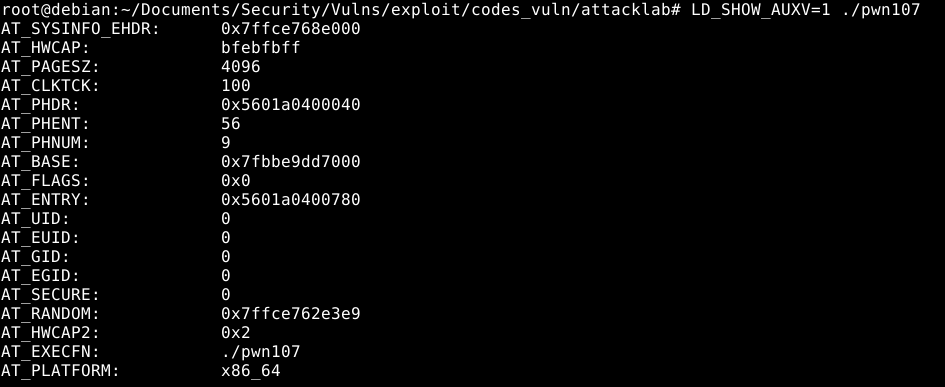

### 3. return user space

Finally, the `start_thread` macro function is called to modify `rip` and `rsp`. This ensures that when the CPU returns to user space after finishing the `execve` system call, it jumps to the new program's entry point. If dynamic linking is required, it enters the linker's `entry`.

After the linker (`ld`) completes its work, it transfers control to `_start`. From this point, the control flow enters the ELF executable code. First, `_start` sets `ebp` to 0 (as suggested by the ABI - Application Binary Interface specification). It then assigns `rdx` to `r9`, pops `argc` into `rsi` (at this point `rsp` points to the beginning of the `argv` array), and assigns `rsp` to `rdx`. A bitwise `AND` operation clears the lower 4 bits of `rsp` to achieve 16-byte stack alignment. `rax` and `rsp` are pushed onto the stack successively (pushing `rax` also aids in alignment). The address of `__libc_csu_fini` is assigned to `r8`, and the address of `__libc_csu_init` is assigned to `rcx`. The address of the `main` function is loaded into `rdi` using relative addressing. Finally, it calls `__libc_start_main` (which has been dynamically bound from `libc.so.6`). Returning from `__libc_start_main` will execute `hlt`.

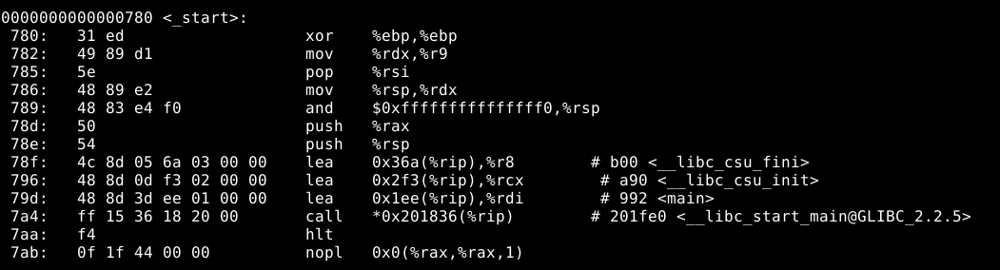

Now the control flow is inside `__libc_start_main`. Its prototype is:
```c
int __libc_start_main(
    int (*main) (int, char **, char **),
    int argc,
    char ** ubp_av,
    void (*init) (void),
    void (*fini) (void),
    void (*rtld_fini) (void),
    void (* stack_end)
);
```
It takes 7 parameters, passed in order: `rdi` = address of `main`, `rsi` = `argc`, `rdx` = address of `argv[]`, `rcx` = address of `__libc_csu_init`, `r8` = address of `__libc_csu_fini`, `r9` = old `rdx`, and the last parameter (`stack_end`) is taken from the top of the stack (`rsp`). Inside this function, it compares user IDs from the auxiliary vector, initializes the thread subsystem, registers various functions, calls `__libc_init_first` (which finds the `envp[]` address based on `argc` and assigns it to the global variable `__environ`), and finally calls `__libc_csu_init` (statically linked from `libc_nonshared.a`).

`__libc_csu_init` serves as the constructor for C-compiled binaries. It first executes `_init`, then iteratively executes all function pointers in the `__init_array__` section. These functions are related to GCC compilation features.

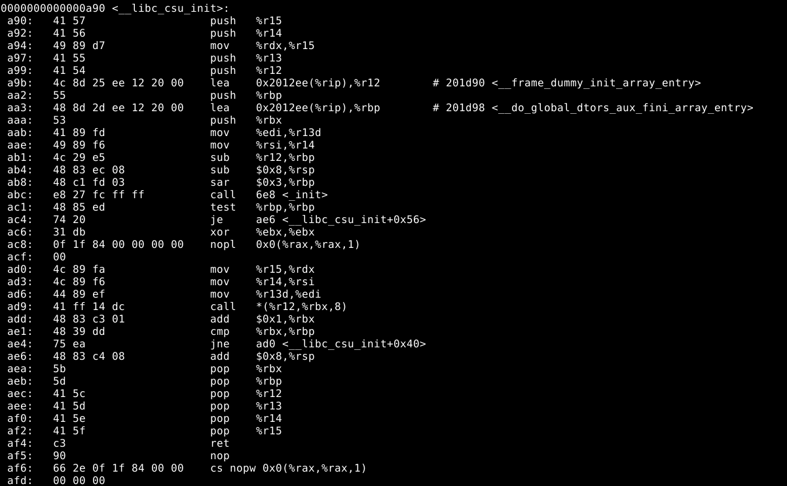

`_init` is a function with an optimized stack frame. If `-pg` is not enabled during compilation, `__gmon_start__` inside it is not called, and it returns directly to `__libc_csu_init`.

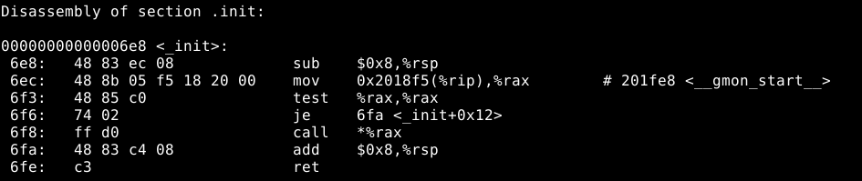

After iterating through all function pointers in `__init_array__`, it returns to `__libc_start_main`. `__libc_start_main` then calls the `main(argc, *argv[])` function, along with the global variable `__environ`, formally entering the programming interface.

Upon returning from `main` to `__libc_start_main`, `__libc_csu_fini` is executed first. Inside it, `_fini` is called, which acts as the destructor for the binary.

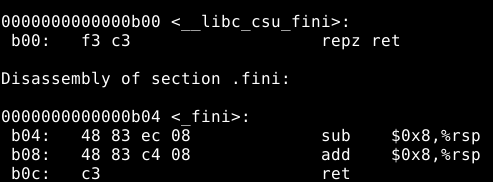

Returning from the destructor to `__libc_start_main`, for a program exiting normally, the return value from `main` is passed to the `exit()` system call. `exit()` performs various cleanup tasks for the process. A complete flowchart is shown below.


## Virtual Memory

### 1. Process User Space

The process user space can be examined via `/proc/$pid/maps` to view the layout and permissions of the process's virtual memory. An exception is the PAX security policy `GRKERNSEC_PROC_MEMMAP`; if enabled, it empties the `/proc/$pid/maps` file, making address space values invisible. Access permissions for this file are controlled by the ptrace access mode `PTRACE_MODE_READ_FSCREDS` check. Therefore, `cat /proc/$pid/maps` essentially reads this process's information via ptrace.

Executing `strace ./pwn107` shows the system calls starting from `execve`. First, `execve` receives three parameters to initialize the process space. `brk(NULL)` is called to get the end of the data segment for use by dynamic allocation functions like `malloc`. This is followed by `mmap` calls to map the linker (`ld`), libc, and thread TLS (Thread-Local Storage). `mprotect` applies read-only protection to specific segments. `prlimit64` limits process resources. `munmap` removes temporarily used segments.

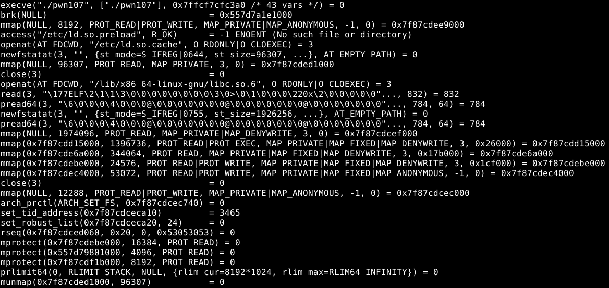

Using `ps`, we find that `strace` started `pwn107` as its child process, with `pwn107` having PID 3465. Use `cat /proc/3465/maps` to view its virtual memory distribution. Permission fields: R = Read, W = Write, X = Execute, S = Shared, P = Private (Copy-on-Write).

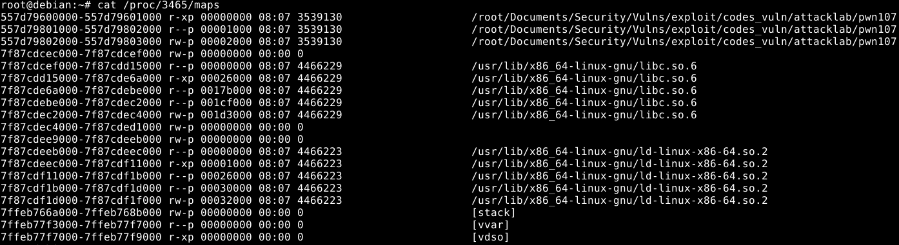

Based on addresses, permissions, and file paths:
1.  The first line is the **code segment (text)**, easily identifiable due to its read+execute permissions.
2.  The second line is the **first part of the data segment**. Due to the use of RELRO (Read-Only Relocations) security protection, it is marked as read-only.
3.  The third line is the **remaining part of the data segment**, with write permissions.
4.  When `malloc()` is called requesting a memory block size exceeding `MMAP_THRESHOLD`, an **anonymous memory segment** is created. This type of anonymous segment is not labeled with `[heap]`.
5.  After the **heap** area comes the **thread TLS**, which is the segment between `pwn107` and `libc` in the diagram.
6.  After thread TLS come the mappings of various **dynamic libraries**.
7.  After the dynamic libraries is the **stack** area, labeled `[stack]`.
8.  At the highest addresses of virtual memory are the `[vvar]` and `[vdso]` segments.

**VDSO (Virtual Dynamic Shared Object)** is used by glibc to invoke frequently used system calls, avoiding potential performance issues. VDSO accelerates execution by performing specific system calls in user space. The `linux-vdso.so.1` mapped into the process address space contains code for making system calls via the `syscall` (64-bit) or `sysenter` (32-bit) instruction. Code within the VDSO accesses kernel-related data located in the `vvar` segment.

In addition to addresses, permissions, and file paths, other useful information is provided: **offset**, **dev (major:minor)**, and **inode**. An inode of 0 indicates no associated inode for the memory region, as is the case with the BSS segment.

### 2. Process Kernel Space

On Intel architecture, virtual addresses are 48 bits, spanning from `0000_0000_0000_0000` to `ffff_ffff_ffff_ffff`. User space is allocated from `0000_0000_0000_0000` to `0000_7fff_ffff_ffff`, and kernel space is allocated from `ffff_8000_0000_0000` to `ffff_ffff_ffff_ffff`.

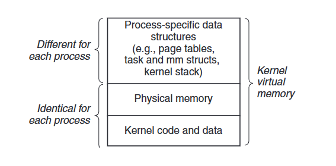

As shown in the figure above, the process kernel space can be divided into two regions. In the region common to all processes, kernel code and data mappings reside, along with physical memory addresses to accelerate virtual-to-physical address translation. The kernel space memory also holds process data structures, such as page tables, the `task_struct`, the `mm_struct`, and the kernel stack.

## Relocation

### 1. Relocation in Static Linking

After the compiler completes compilation and assembly (e.g., a relocatable object file generated by `gcc -c`), use `readelf -r` to view relocation information. As shown, the `.rela.text` section (at file offset `0x220`) contains 5 entries indicating information that needs to be modified in the `.text` section. The image below shows the relocation information of an object file.

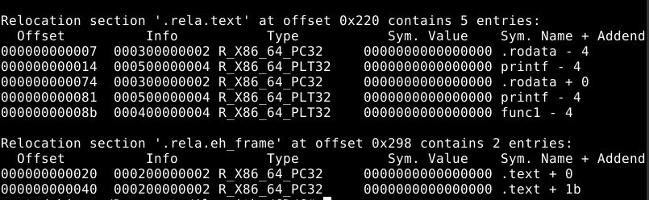

First, use `objdump -M intel -d` to compare the contents of the `.text` section in the object file and the final executable. Comparing with the relocation information, we can see that after linking, the executable modified the machine code of instructions at specific offsets: for example, at offset `0x7`, `0x00000ec0` (little-endian) was added. Similarly, modifications were made at offsets `0x14`, `0x74`, etc. The image below shows a comparison between the object file and the executable.

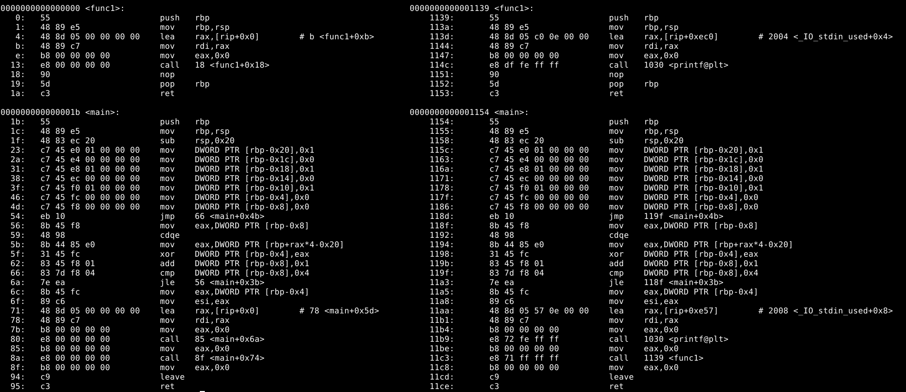

Next, examining the specific content modified in the linked executable with `objdump -D` (disassemble all sections): The `0x0ec0` added at offset `0x7` (address `0x1140`) is used in the instruction `lea rax, [rip+0xec0]`. Here, `rip` is the address of the next instruction, making it reference data at the relative address `0x2004` (`0x1144 + 0x0ec0`). This data, `0x796573`, located in the `.rodata` section, corresponds to the ASCII string "yes". At offset `0x8b`, the `call` instruction was modified to call `func1` within the `.text` section. Evidently, these two types of references are fully resolved by the linker during the static linking phase and modified into relative addressing instructions. The image below shows the `.rodata` section of the executable.

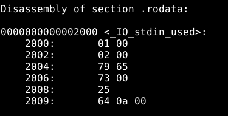

In contrast, the `printf` function call points to the glibc dynamic library. The glibc library has only one physical instance but is mapped to different virtual addresses in different processes. Due to this indeterminate virtual address, the `printf` function is **not fully resolved** by the compiler/linker during the **static linking phase**. Instead, its resolution is deferred until runtime, where it will be **fully resolved** by the `ld-linux` dynamic linker.

### 2. Relocation in Dynamic Linking

To enable dynamic linking, executables introduce the **Procedure Linkage Table (PLT)** and the **Global Offset Table (GOT)**. The PLT is introduced to implement **lazy binding**, meaning addresses are bound in real-time only when the corresponding code or data is actually used. If only the GOT were used to store address offsets, the dynamic linker would need to resolve all library symbols at program startup, corresponding to **Full RELRO** (sacrificing some performance for security). Use `readelf -r` to view the relocation information of an executable. (On Windows platforms, the analogous structures for dynamic linking are the IAT and INT tables).

In the example, the `.rela.dyn` section (file offset `0x540`) contains 2 entries needing modification in the `.dynamic` section and 1 in the `.data` section, all of type `RELATIVE`. It also contains 5 entries needing modification in the `.got` section, of type `GLOB_DAT`. The `.rela.plt` section contains 1 entry needing modification in the `.got.plt` section, of type `JUMP_SLOT`.

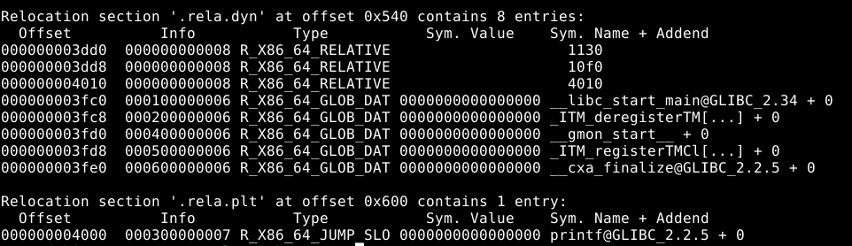

**Lazy Binding, .plt, .got, .got.plt, .plt.got:**

The following two diagrams show four sections implementing PLT and GOT: `.plt`, `.got`, `.got.plt`, and `.plt.got`. Notably, the `.got` section is empty in this case. The `.plt` section stores `push` and `jmp` instructions that reference `.got.plt`. Both `.got` and `.got.plt` are used to store global offsets. The key distinction is that when **Partial RELRO** is enabled, `.got` becomes read-only after initialization by `ld-linux`, while `.got.plt` remains writable to facilitate lazy binding. As for `.plt.got`, when **Full RELRO** is enabled at compile time, it replaces the longer `.plt` section for referencing the merged `.got`.

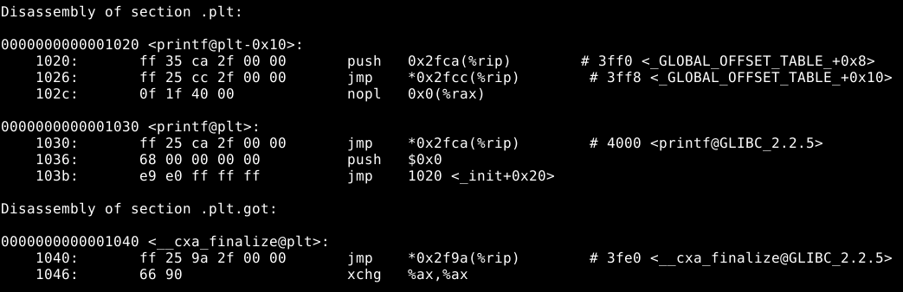

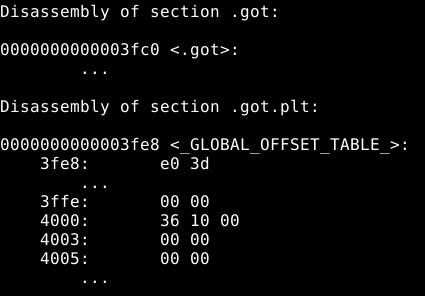

Similar to the static linking of `func1`, the instruction calling `printf` is modified to `call <printf@plt>`. This symbol resides in the `.plt` section. The instruction block `<printf@plt>` contains a relative addressing instruction `jmp *0x2fca(%rip)`, which jumps to the address stored in the `.got.plt` section at `0x4000` (`0x2fca + 0x1036`). This location holds the little-endian value `0x1036`. This address will be modified by `ld-linux` at two points: **1) program startup** and **2) during lazy binding**, and has `rw-` permissions.

1) **At program startup**, based on the offset `0x1036`, the address is initially modified to the runtime virtual address of the *next instruction* `push 0x0` (where `0` is the `reloc_index` representing `printf`, serving as argument 1 for the `_dl_runtime_resolve` function during lazy binding). In the example below, this virtual address is `0x55954961e036`.

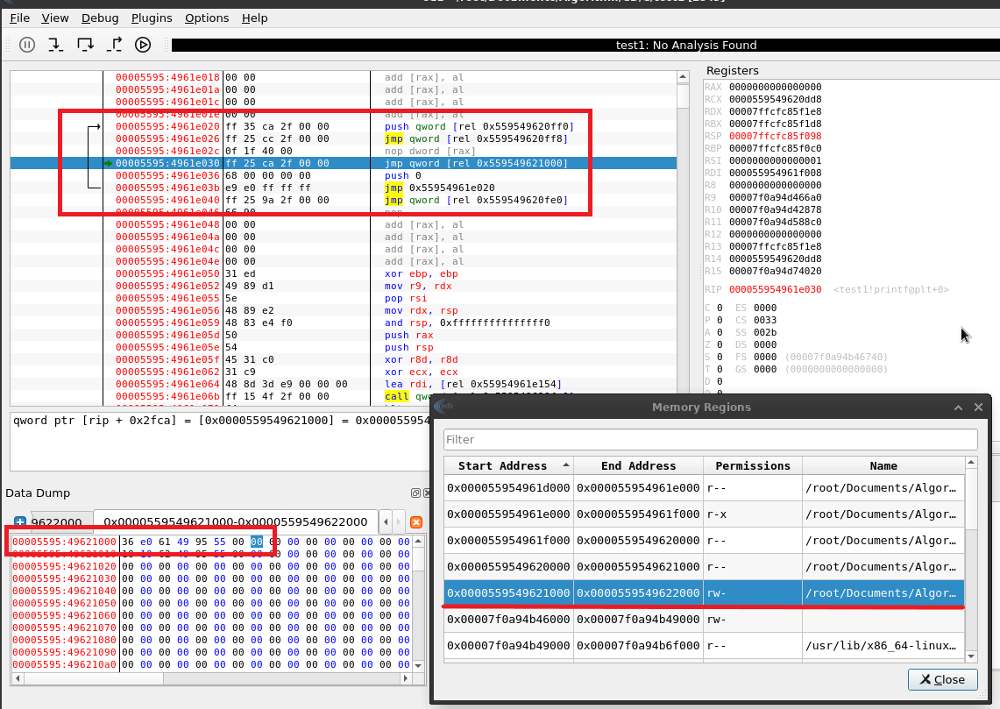

2) **During lazy binding**, execution jumps back to `push 0x0` at the address from step 1. The next relative addressing instruction then jumps to `<printf@plt-0x10>`. The purpose of the two instructions at this address is to invoke `ld-linux` to find the address of `printf` within `libc.so` and subsequently **modify the virtual address from step 1**.
    *   The first instruction, `push 0x2fca(%rip)`, pushes the address of the `link_map` structure (located at `0x3ff0`) onto the stack (argument 2 for `_dl_runtime_resolve`).
    *   The next relative addressing instruction jumps to the address stored at `0x3ff8`, which points to the `_dl_runtime_resolve` function within `ld-linux`.

The addresses for the `link_map` and `_dl_runtime_resolve` are both added to the `.got` section by `ld-linux` at runtime and have `r--` permissions. `link_map` is a structure constructed by `ld-linux`, storing information like the binary's virtual base address, name, address of the `.dynamic` section, etc., to facilitate dynamic linking.

As shown in the diagram below, the read-only area contains the `link_map` address `0x00007f0a94d752e0` and the `_dl_runtime_resolve` address `0x00007f0a94d54220`.

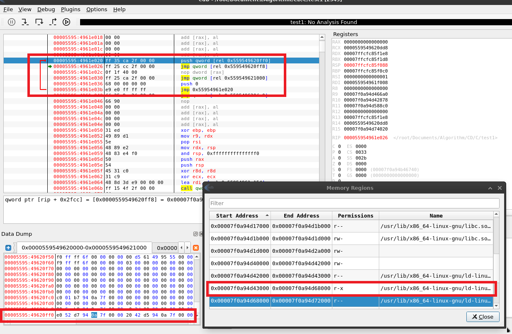

After `_dl_runtime_resolve` modifies the virtual address from step 1, it jumps to that address to execute `printf` (returned by `_dl_fixup`). Subsequent calls to `printf` will then execute only the first jump instruction in `<printf@plt>`. The complete lazy binding flowchart is shown below.

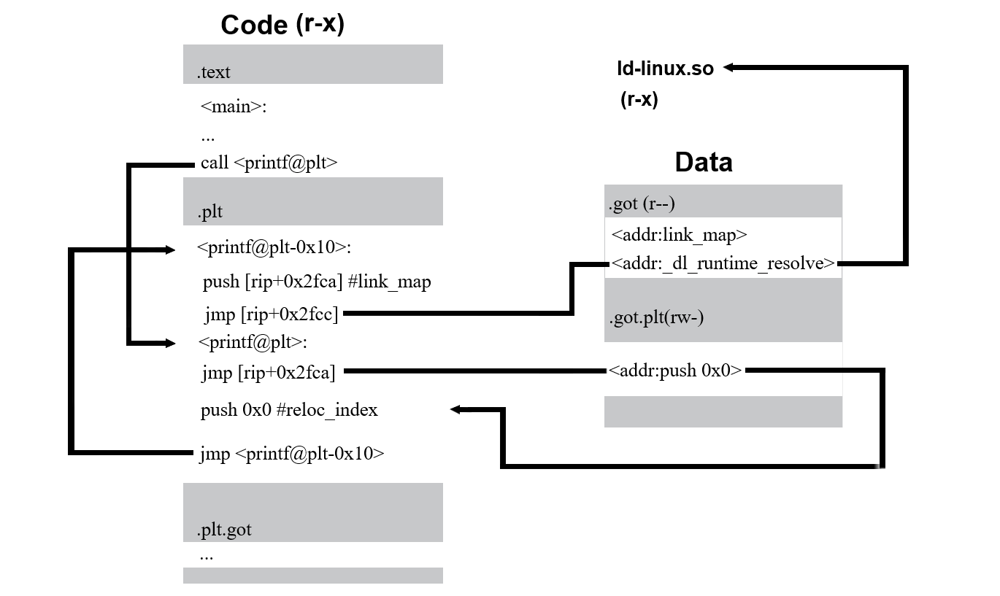

State after modifying the virtual address from step 1:

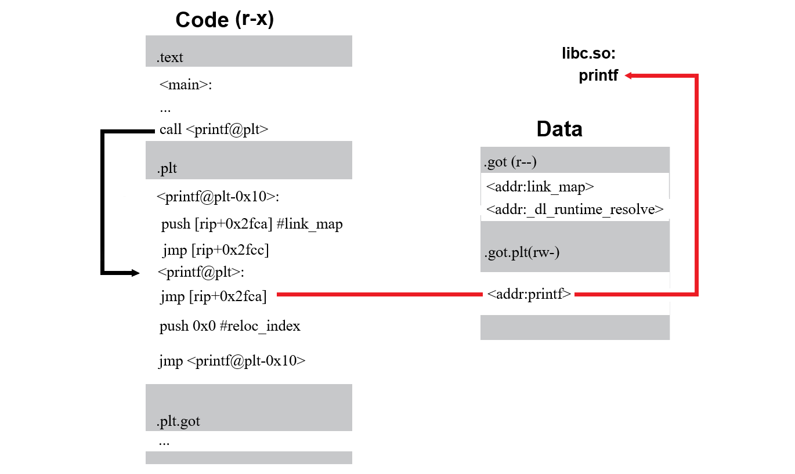

**Why introduce `.got.plt` instead of modifying the `jmp` instruction within `<printf@plt>` directly?** Because the `.plt` section resides in the executable code segment. To ensure program security, executable segments must be non-writable (i.e., `r-x`). Similarly, references to relocatable data symbols (like variables and constants exported from shared libraries) also need redirection through the GOT to avoid embedding data addresses directly into the code. The difference is that data references go directly through the GOT without the intermediate PLT step.

**.dynamic, .dynsym, .dynstr:**

Use `readelf --dynamic` to view the `.dynamic` section of an executable. This section is a table of structures containing different tags and their values. Tags of type `NEEDED` inform `ld-linux` of the executable's dependencies. For example, if the binary uses the `printf` function from the `libc.so.6` shared library, it needs to be loaded at execution. Tags `VERNEED` and `VERNEEDNUM` specify the address (here, `.gnu.version_r`) and number of entries for the version dependency table, indicating the expected versions of various dependencies.

Besides listing dependencies, `.dynamic` also contains pointers to other crucial information needed by `ld-linux` (e.g., tags of type `STRTAB`, `SYMTAB`, `PLTGOT`, `RELA`, and `JMPREL` point to the dynamic string section `.dynstr`, dynamic symbol section `.dynsym`, section `.got.plt`, section `.rela.dyn`, and section `.rela.plt`, respectively).

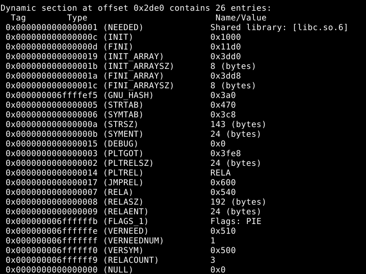

Viewing `.dynsym` information via `readelf -sW test`:

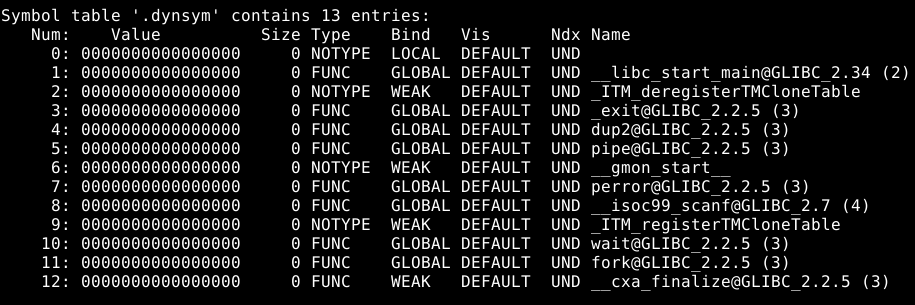

The symbol table entries have the following structure:
```c
typedef struct {
    uint32_t      st_name;   /* Symbol name (string tbl index) */
    unsigned char st_info;   /* Symbol type and binding */
    unsigned char st_other;  /* Symbol visibility */
    uint16_t      st_shndx;  /* Section index */
    Elf64_Addr    st_value;  /* Symbol value (address/offset) */
    uint64_t      st_size;   /* Symbol size */
} Elf64_Sym;
```
Symbol types include:
*   `STT_NOTYPE`: Symbol type is unspecified.
*   `STT_FUNC`: Symbol is associated with a function or executable code.
*   `STT_OBJECT`: Symbol is associated with a data object.

Symbol binding:
*   `STB_LOCAL`: Local symbol, not visible outside the object file (e.g., `static` functions).
*   `STB_GLOBAL`: Global symbol, visible.

View strings in the `.dynstr` section via `readelf -p .dynstr test`.


The `.gnu.hash` section is used to speed up symbol name searches.

**ld-linux.so:**

The `.interp` section specifies the path to the `ld-linux` dynamic linker. Use `readelf -p .interp test` to see its absolute path: `/lib64/ld-linux-x86-64.so.2`.

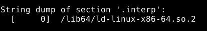

Analyzing `/lib64/ld-linux-x86-64.so.2` reveals it is a **statically linked executable** with its own `entry` point. Whenever a dynamically linked program runs, the kernel first maps the `ld` physical memory into the virtual address space and then starts execution from `ld`'s `entry` point.

That is, after the `execve()` system call returns to `ld`'s `entry` point, it parses the binary file to identify the dynamic libraries used by the ELF file. `ld` maps these into the virtual address space (using `mmap` or equivalent) and, based on RELRO settings, populates the `.got` and modifies `.got.plt`. For **Partial RELRO**, critical references like `__libc_start_main` are bound and set to read-only at startup, while other references are filled with their correct addresses from dynamic libraries via **lazy binding** when first used. For **Full RELRO**, all references are bound at startup, and the `.plt.got` (or merged GOT) is set to read-only.

After completing these tasks, `ld` reads the program entry point from the auxiliary vector (usually `_start`) and transfers control to `_start` to begin execution.

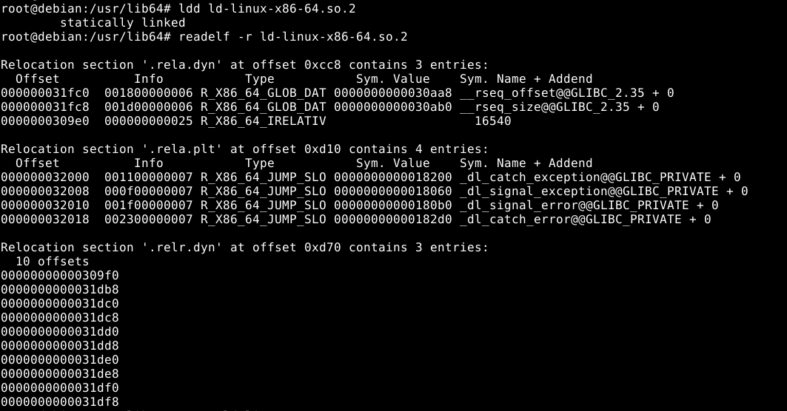

**When lazy binding is enabled, the linker creates a `link_map` structure entry for each shared library (`so`) and stores them in a linked list:**

```c
struct link_map
{
    ElfW(Addr) l_addr;          /* Base address shared object is loaded at. */
    char      *l_name;          /* Absolute file name object was found in. */
    ElfW(Dyn) *l_ld;            /* Dynamic section of the shared object. */
    struct link_map *l_next, *l_prev; /* Chain of loaded objects. */
    // ...
    ElfW(Dyn) *l_info[];        /* DT_STRTAB, DT_JMPREL... */
    // ...
};
```

On the first call to an unresolved function, the `reloc_arg` and the corresponding library's `link_map` address are pushed onto the stack in order, and execution jumps to `_dl_runtime_resolve`. This function saves the register state and passes arguments via `rdi` and `rsi` to the `_dl_fixup` function, which is the core of dynamic resolution. The execution of `_dl_fixup` proceeds as follows:
1)  Using the `l_info` pointer array from the `link_map`, it retrieves the addresses of `.rela.plt`, `.dynsym`, and `.dynstr`.
2)  `.rela.plt + (reloc_arg * sizeof(Elf64_Rela))` calculates the pointer to the current function's relocation table entry (`Elf64_Rela`), denoted as `reloc`.
3)  Using `ELFW(R_SYM)(reloc->r_info)` as an index into `.dynsym`, it finds the pointer to the current function's symbol table entry (`Elf64_Sym`), denoted as `sym`.
4)  `.dynstr + sym->st_name` yields the symbol name string.
5)  It looks up this function's address within the dynamic libraries and assigns it to `*(reloc->r_offset)`, i.e., the corresponding `.got.plt` entry.

### 3. Position Independence and ASLR

**The principle of Position Independence:** Instructions achieve position independence by using relative addressing amongst themselves. Similarly, references to other segments, like the data segment, are implemented using fixed offsets between segments.

A **Position Independent Executable (PIE)**, identified by `file` command, has PIE enabled. For dynamic library files (`.so` files), the same principle applies and is termed **Position Independent Code (PIC)** or **PIE DSO (Dynamic Shared Objects)**.

**Why, when ASLR=2 but PIE is *not* enabled, are the addresses of BSS, DATA, and TEXT segments still fixed rather than fully randomized?**
Because PIE is what makes the BSS, DATA, and TEXT segments position-independent, thereby allowing for their **complete randomization** in the virtual address space. ASLR, on the other hand, randomizes address spaces that are allocated at runtime, such as STACK, HEAP, and memory-mapped regions (MMAP).