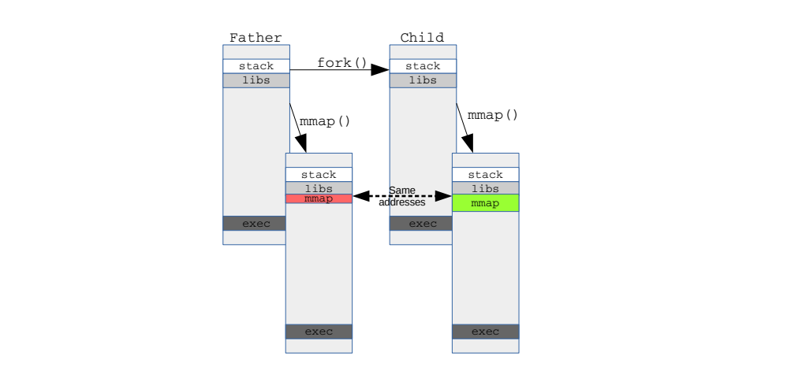
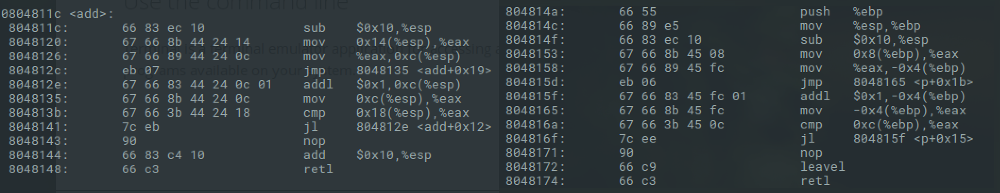

## File Mitigations

### 1. User Space W^X

**W^X** (short for "write xor execute") is a security feature used by operating systems to combat code injection attacks like `ret2shellcode` and other forms of data area execution. It prevents a program from having any memory page that is both **writable** and **executable**. ROP (Return-Oriented Programming) techniques were developed to bypass W^X.

W^X is implemented on the user-space side using **DEP (Data Execution Prevention)** / **NX (No-eXecute)** / **XD (eXecute Disable)**. Taking Linux NX as an example: when `execve` maps the memory space, it sets page permissions on a per-page basis during calls to `mmap` and `mprotect`.

### 2. Randomization

With ROP bypassing W^X, based on position-independent techniques, **ASLR(Address Space Layout Randomization)** was proposed by PaX in 2001. During the `execve` call, randomization is applied in the following order:

1. **Randomization of `mmap` base address.** Once the `mmap` base address is determined, the offsets of various memory segments relative to this base are fixed across system runs for a given program.
2. **Stack randomization.**
3. **If PIE (Position Independent Executable) is enabled, randomization of the BSS, DATA, and TEXT segments.**
4. **Heap randomization.**

When enabling ASLR, the OS checks if the executable is a PIE executable. On Linux systems, ASLR has three levels:

- 0，No randomization. Everything is static.
- 1，Conservative randomization. Shared libraries, stack, mmap(), VDSO, and heap are randomized.
- 2，Full randomization. In addition to the elements mentioned above, memory managed by brk() is also randomly allocated.


The ASLR level can be configured in two ways:
``` shell
echo level > /proc/sys/kernel/randomize_va_space
```
or
``` shell
sysctl -w kernel.randomize_va_space=level
```

**Fixed aspects within ASLR randomization:**
1. Relative positions of segments remain fixed.
2. The first 2 bits and the last 3 bits of addresses are fixed.
3. Memory addresses are inherited by `fork()`.



### 3. User Stack Canary

**Optimal Layout:**

Optimal layout often accompanies canary usage. Sensitive information, such as the saved base pointer (`rbp`) and important structure local variables, is placed **after** the canary in the stack frame to maximize the canary's effectiveness.

**Types of Canary:**

There are two main types of canaries:
1. **Terminator Canary:** e.g., `0x000aff0d`. The `\x00` null byte prevents overflows via `strcpy()` and related functions, `\x0d` (carriage return) and `\x0a` (line feed) prevent `gets()` and related functions, and `\xff` (EOF) prevents others.
2. **Random Canary:** Generated randomly at process runtime.

**Application:**

Canaries are used to protect the stack, heap, file descriptors, and other important data or structures in memory:

*   **StackGuard** was first proposed in 1997, using a canary to ensure the return address (`rip`) is not tampered with.
*   **Windows GS** protection was introduced with Visual C++ 7 in 2002.
*   The **Linux GCC** compilation option `-fstack-protector` uses canaries to protect the stack.
*   **Cred canary** is used to protect the `cred` structure (credentials) from being overwritten.

Taking the Linux GCC stack protection scheme as an example: The canary value is saved in the **Thread Control Block (TCB)** structure when a thread/process is initialized, specifically in a field like `uintptr_t stack_guard`.

``` c
// glibc    sysdeps/x86_64/nptl/tls.h
typedef struct
{
  void *tcb;		/* Pointer to the TCB.  Not necessarily the
			   thread descriptor used by libpthread.  */
  dtv_t *dtv;
  void *self;		/* Pointer to the thread descriptor.  */
  int multiple_threads;
  int gscope_flag;
  uintptr_t sysinfo;
  uintptr_t stack_guard;   // %fs:0x28
  uintptr_t pointer_guard;

  ...
} tcbhead_t;
```

The address of the TCB structure itself is stored in the `%fs` segment register. When the canary is used, it is accessed via `%fs:0x28`, where `0x28` is the offset of the `stack_guard` field within the TCB.

### 4. Data Protection

**RELRO (Relocations Read-Only)**:

Protects the `.got` section. By default, **Partial RELRO** is enabled, setting sections like `.dynamic` and `.got` to read-only after initialization. If **Full RELRO** is enabled, lazy binding is disabled, the `.got.plt` section is fully merged into `.got`, and all references are set to read-only after initialization.

**Fortify**:

A GCC security feature. Enabled by specifying the compile option `-D_FORTIFY_SOURCE=1` (or `2`) or `-O2`. It replaces standard library function calls with safer versions that include additional checks. `FORTIFY_SOURCE` primarily provides the following types of checks:
*   **Buffer Overflow Checks**: Checks if the length of a source string exceeds the size of the destination buffer during string copy or concatenation operations.
*   **Format String Checks**: Checks if the arguments to format string functions (like `printf`, `sprintf`) match the placeholders in the format string. Positional arguments must be used consecutively, and the format string cannot contain `%n` when located in a writable area.
*   **Memory Operation Checks**: Checks if the sizes of source and destination memory blocks match during operations like `memcpy`, `memset`.

**Stack Frame Options**:

*   Use `-fno-omit-frame-pointer` to enable the use of frame pointers.
*   Use `-fomit-frame-pointer` to disable them (an optimization).
The diagram on the left shows code with frame pointer optimization enabled, while the right side shows it disabled. The key difference is the elimination of instructions like `push` and `leave` needed to manage the stack frame.



### 5. CFI

**CFI (Control Flow Integrity)**, supported by Intel CET (Control-flow Enforcement Technology), can be used to mitigate ROP/JOP attacks and Data-only attacks.
1.  **Shadow Stack**: A secondary stack that securely stores return addresses to protect against ROP attacks that tamper with the regular call stack.
2.  **IET (Indirect Branch Tracking)**: A hardware mechanism to restrict the targets of indirect branches (like jumps via function pointers), mitigating JOP attacks.


## Kernel Mitigations

### 1. Kernel Space W^X

**KERNEXEC** (non-executable kernel pages) ensures that within the kernel, only code areas are executable and not writable, equivalent to NX within the kernel.

### 2. Randomization

In 2002, PaX proposed **RANDKSTACK**, introducing randomization to the kernel stack. RANDKSTACK ensures the kernel stack is randomized upon entry to each system call.

In 2005, PaX proposed **KASLR (Kernel Address Space Layout Randomization)**. In a kernel with KASLR enabled, the base addresses of the kernel's code segment, among others, are shifted as a whole.

**FGKASLR (Function Granular KASLR)** builds upon KASLR's base address randomization. At load time, it rearranges the kernel code on a **per-function granularity**.

### 3. Kernel Stack Canary

The kernel stack is protected using a **kernel stack cookie**.

### 4. Data Protection

**STACKLEAK:**

Erases the kernel stack upon entry to and exit from kernel mode. Before returning to user space, it fills the used portion of the kernel stack with a poison value to scrub sensitive data.

### 5. Isolation

**SMAP/SMEP**:

Hardware-level protections introduced by Intel, controlled by bits 20 and 21 of the CR4 register.
*   **SMAP (Supervisor Mode Access Prevention)**: Prevents the kernel from directly **accessing** user-space data while in supervisor (kernel) mode.
*   **SMEP (Supervisor Mode Execution Prevention)**: Prevents the kernel from directly **executing** user-space code while in supervisor mode.
These two protections are typically enabled together to completely separate kernel space from user space, guarding against attacks like `ret2usr` (return-to-user).

**KPTI / KVA Shadow**:

*   **KPTI (Kernel Page-Table Isolation)**: Introduced in Linux. The kernel and user mode use **different page tables**. User-mode page tables retain only the minimal kernel pages necessary for entering/exiting the kernel. It aims to mitigate vulnerabilities like Meltdown and Spectre v2.
*   **KVA Shadow**: The Windows equivalent of KPTI.

## Process Mitigations

### 1. Isolation

**SELinux Sandbox**:

Maximally restricts the actions of malicious code.
`Subject -> SELinux -> Analyze Policy Rules -> Security Context -> If Compliant -> Target`
`-> If Non-compliant -> Deny Access`
It operates in three modes:
1.  **Disabled**: For environments not requiring enhanced security.
2.  **Permissive**: Detects policy violations but does not block them, only logging messages.
3.  **Enforcing**: Enables SELinux and enforces security policies.

### 2. Restriction

**seccomp**: 

A Linux security module used to restrict the system calls a process can make.